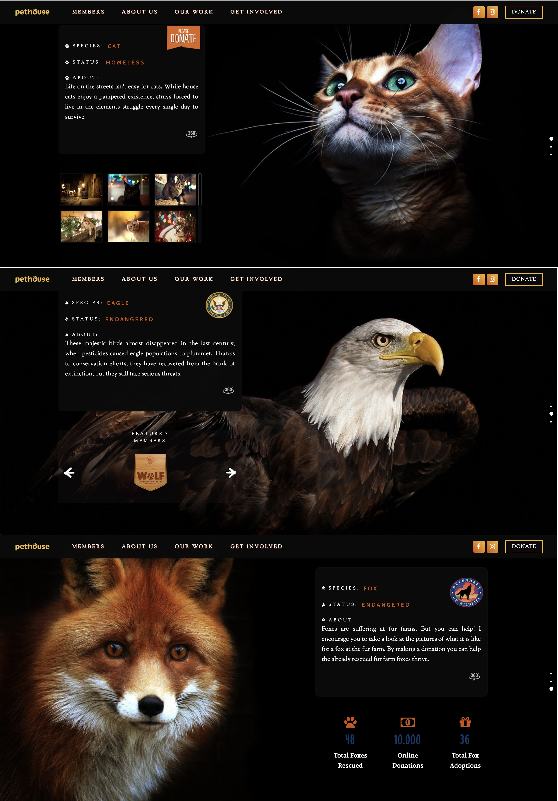

<h1>Личный проект "Wild Animals"</h1>

Author: Karuk Viktoriia

<h2>Technologies</h2>

HTML5, CSS3, BEM, Bootstrap, Jquery, Gulp include uses a Sass with <strong>SCSS</strong> syntax.

<h3>How to start</h3>
<table>
  <thead>
    <tr>
      <th>Action</th>
      <th>Result</th>
    </tr>
  </thead>
  <tbody>
  <tr>
    <td width="30%"><code>git clone https://github.com/Victorypa/OnePageScroll.git</code></td>
    <td>Clone the source code of online-store GitHub repository</td>
  </tr>
    <tr>
      <td width="30%"><code>npm i</code></td>
      <td>Install dependencies</td>
    </tr>
    <tr>
      <td><code>gulp watch</code></td>
      <td>Run the template</td>
    </tr>
  </tbody>
</table>

---

## Превью сайта
